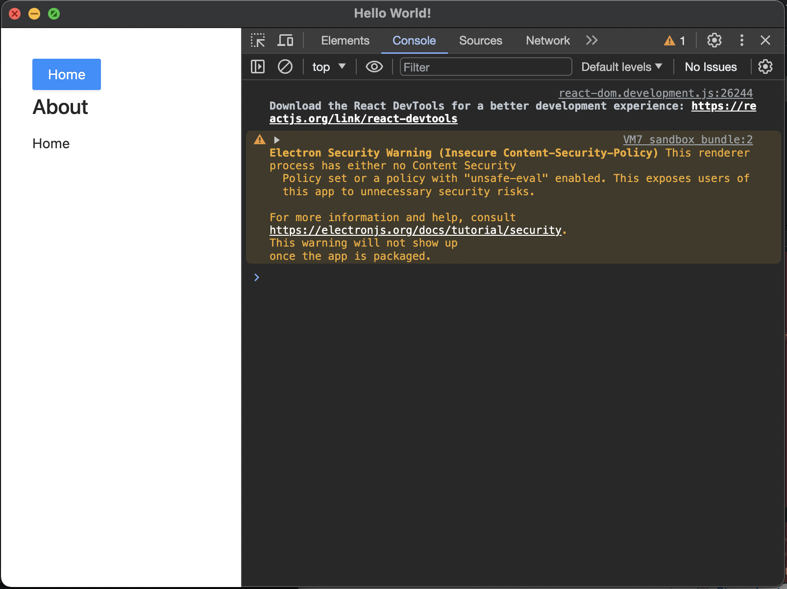

## Electron + TypeScript + React + SQLite

Boilerplate for a project using Electron, React, Typescript and SQLite.

- Initiate this app using boilerplate from electron-forge
`https://www.electronforge.io/templates/typescript-+-webpack-template`

- Using better-sqlite3 due to branchmark result and total user's download this package `https://www.npmjs.com/package/better-sqlite3`

## Installation

1. Clone repository
```bash
git clone https://github.com/yasminghassani/my-electron-app.git && cd my-electron-app
```

2. Install all dependencies
```bash
yarn install
```

3. Run app
```bash
yarn start
```

## Hello world
If you success run this app, it will looks like below

